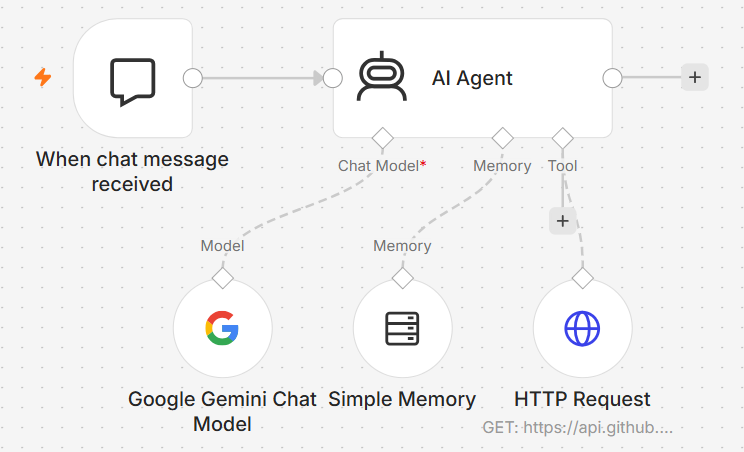
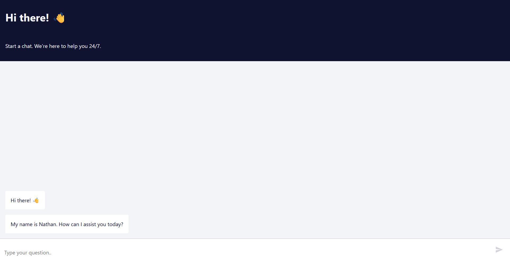
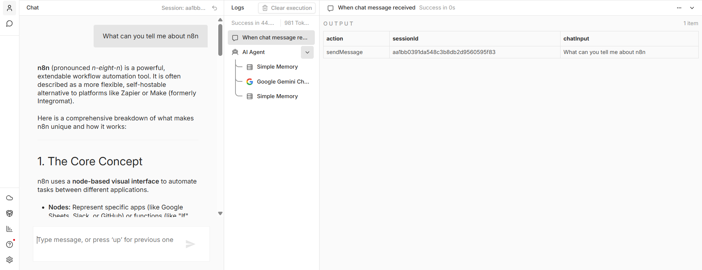

# 🤖 AI Webpage Summarizer Chatbot with n8n & Gemini

> An AI-powered chatbot that retrieves webpage content and answers user questions using Google Gemini Flash.

## 📌 Overview

This project combines workflow automation and Generative AI to create an intelligent chatbot capable of understanding, summarizing, and answering questions about web content.

The workflow leverages n8n's AI Agent capabilities together with Google Gemini Flash and HTTP-based content retrieval.

---

## ✨ Features

✅ AI Agent implementation

✅ Google Gemini Flash integration

✅ Webpage content retrieval

✅ Conversational Q&A

✅ Intelligent summarization

✅ Automated context processing

✅ Low-code AI workflow design

---

## 🧠 How It Works

User Question
      ↓
AI Agent
      ↓
HTTP Request Tool
      ↓
Webpage Content Retrieval
      ↓
Gemini Flash Processing
      ↓
Generated Answer

---

## ⚙️ Technologies Used

- n8n
- Google Gemini Flash
- AI Agent Node
- HTTP Request Node
- Generative AI
- Workflow Automation

---

## 🎯 Use Cases

- Documentation assistants
- Knowledge retrieval systems
- AI-powered support bots
- Content summarization
- Research assistance

---

## 📸 Screenshots

### AI Workflow

### Example Conversation

### Generated Response

---

## 🚀 Getting Started

1. Download `workflow.json`
2. Import into n8n
3. Configure Gemini API credentials
4. Update target webpage URL
5. Execute workflow

---

## 💡 Learning Outcomes

Through this project I explored:

- AI Agent orchestration
- LLM integration within n8n
- Retrieval-based workflows
- Prompt engineering concepts
- Tool-enabled AI agents
- Low-code AI application development

---

## 👨‍💻 Author

Built as part of my exploration into AI Agents, Workflow Automation, and Generative AI Applications.
